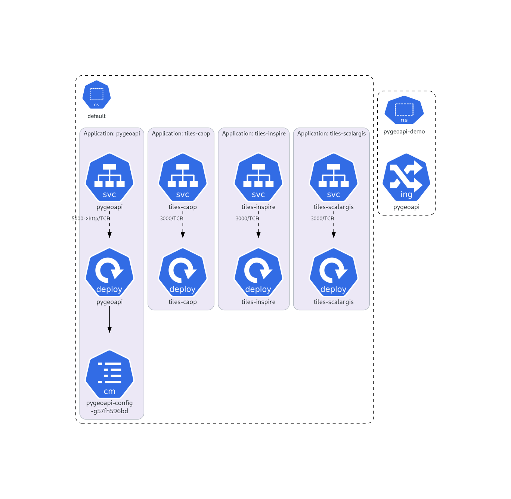

# Kubernetes deployment of OGC API DGT

This projects migrates the [OGCAPI](https://github.com/dgterritorio/OGCAPI) suite of services, implemented with docker compose, towards a kubernetes based architecture.

This directory contains a Kubernetes deployment of:

* A [pygeoapi](https://pygeoapi.io/) instance, configured to show some - and eventually, all - collections 
  from [OGC API DGT](https://github.com/dgterritorio/OGCAPI). 
* Tiles servers for the CAOP and cadastro collections (tiles-caop, tiles-inspire, tiles-scalargis, tiles-cos). The servers use [martin](https://github.com/maplibre/martin) a blazing fast and lightweight PostGIS tile server.

The Kubernetes manifests needed to run this server are generated with
[Kustomize](https://kustomize.io/). They build upon [a common base definition](./base/).



## Required tools

To deploy and run these samples you will need the following tools:
* [Kustomize](https://kustomize.io/),
* The [kubectl](https://kubernetes.io/docs/tasks/tools/#kubectl) command-line tool,
* [Flannel](https://github.com/flannel-io/flannel), a container networking interface (CNI) plugin,
* [Ingress](https://kubernetes.io/docs/concepts/services-networking/ingress/), a resource that manages external access to services within the cluster,
* [MetalLB](https://metallb.io/), a load balancer.

## Deplying to a local cluster

Tested under Linux.

## Bring the cluster up

The cluster should be up and running now. Try the following command to
view its state:

    kubectl get pods -n kube-system
        NAME                                      READY   STATUS    RESTARTS   AGE
        coredns-674b8bbfcf-2zwpp                  1/1     Running   0          6d19h
        coredns-674b8bbfcf-47cq6                  1/1     Running   0          6d19h
        etcd-srvquaintergeo1                      1/1     Running   17         6d19h
        kube-apiserver-srvquaintergeo1            1/1     Running   17         6d19h
        kube-controller-manager-srvquaintergeo1   1/1     Running   1          6d19h
        kube-proxy-44rmd                          1/1     Running   0          6d17h
        kube-proxy-kv4d4                          1/1     Running   0          6d17h
        kube-proxy-wvvtk                          1/1     Running   0          6d17h
        kube-scheduler-srvquaintergeo1            1/1     Running   23         6d19h

    kubectl get nodes
        NAME              STATUS   ROLES           AGE     VERSION
        srvquaintergeo1   Ready    control-plane   6d19h   v1.33.3
        srvquaintergeo2   Ready    <none>          6d19h   v1.33.3
        srvquaintergeo3   Ready    <none>          6d19h   v1.33.3

## Deploy pygeoapi

**Note: before starting the deployment, make sure that the IPs of all the nodes are authorised in the databases (e.g.: `inspire`, `cos`, `caop`); failure to do so will trigger errors on the pygeoapi and tiles pods!**

If you need to reset a previous installation, go to [troubleshooting](#troubleshooting).

Create the Kubernetes namespace to host pygeoapi:

    kubectl create ns ogcapi
    namespace/ogcapi created

From this directory, generate and apply the Kubernetes manifests with the
following command:

    kustomize build . | kubectl apply -f -
    configmap/database-config-fmfm5hc2m5 created
    configmap/initdb-kcdht48dgb created
    configmap/pygeoapi-config-4gmh495k44 created
    secret/database-credentials-4ctbtbgmb5 created
    service/postgresql created
    service/pygeoapi created
    deployment.apps/pygeoapi created
    statefulset.apps/postgresql created
    ingress.networking.k8s.io/pygeoapi created

Check the pods are up and running:

```
  kubectl -n ogcapi get pods
  NAME                        READY   STATUS    RESTARTS   AGE
  pygeoapi-6d989df987-2v2p4   1/1     Running   0          9m1s
  pygeoapi-6d989df987-klkwb   1/1     Running   0          9m1s
```

You can check the logs of one deployment with:

    kubectl logs -f pygeoapi-6d989df987-2v2p4 -n ogcapi

## Install Ingress

    mkdir -p /tmp/ingress-install
    cd /tmp/ingress-install
    curl -o deploy.yaml https://raw.githubusercontent.com/kubernetes/ingress-nginx/controller-v1.10.1/deploy/static/provider/cloud/deploy.yaml

Save this as /tmp/ingress-install/kustomization.yaml:

    apiVersion: kustomize.config.k8s.io/v1beta1
    kind: Kustomization

    # This line forces every resource into your namespace
    namespace: ogcapi

    resources:
    - deploy.yaml

Apply:

    kubectl apply -k .

## Create secrets from .env file

```bash
kubectl create secret generic app-secrets \
  --from-env-file=.env \
  -n ogcapi
```
In case it exists, delete it first:

```bash
kubectl delete secret app-secrets -n ogcapi
```

## SSL

Create secret in the ogcapi namespace:

```bash
kubectl create secret tls pygeoapi-tls-secret \
  --cert=/home/byteroad/fullchain1.pem \
  --key=/home/byteroad/privkey1.pem \
  -n ogcapi
```

In case it exists, delete it first:

```bash
kubectl delete secret pygeoapi-tls-secret -n ogcapi
```

## Access the server

Get ingress ports (here, 31356 and 30244):

```
kubectl get service -n ogcapi
NAME                                 TYPE           CLUSTER-IP      EXTERNAL-IP   PORT(S)                     AGE
ingress-nginx-controller             LoadBalancer   10.100.243.63   <pending>     80:31356/TCP,443:30244/TCP  46m
ingress-nginx-controller-admission   ClusterIP      10.111.8.54     <none>        443/TCP                     46m
...
```

Check where ingress is running (here, vmintergeo2):

    kubectl get pods -n ogcapi -o wide

    NAME                                        READY   STATUS             RESTARTS         AGE   IP            NODE          NOMINATED NODE   READINESS GATES
    ingress-nginx-admission-create-55f5j        0/1     Completed          0                50m   10.244.2.7    vmintergeo3   <none>           <none>
    ingress-nginx-admission-patch-b9bj2         0/1     Completed          1                50m   10.244.2.8    vmintergeo3   <none>           <none>
    ingress-nginx-controller-6d675964ff-x8gd6   1/1     Running            0                50m   10.244.1.7    vmintergeo2   <none>           <none>


Get IP of that server (here, 192.168.2.42):

    kubectl get nodes -o wide
    NAME          STATUS   ROLES           AGE    VERSION    INTERNAL-IP    EXTERNAL-IP   OS-IMAGE             KERNEL-VERSION      CONTAINER-RUNTIME
    vmintergeo1   Ready    control-plane   134m   v1.30.14   192.168.2.41   <none>        Ubuntu 24.04.4 LTS   6.8.0-124-generic   containerd://2.2.1
    vmintergeo2   Ready    <none>          110m   v1.30.14   192.168.2.42   <none>        Ubuntu 24.04.4 LTS   6.8.0-124-generic   containerd://2.2.1
    vmintergeo3   Ready    <none>          94m    v1.30.14   192.168.2.43   <none>        Ubuntu 24.04.4 LTS   6.8.0-124-generic   containerd://2.2.1

Connect to the server:

    curl 192.168.2.42:31356

## Load Balancer

To activate a load balancer that assigns IPs, we use MetalLB. Install with:

    kubectl apply -f https://raw.githubusercontent.com/metallb/metallb/v0.14.5/config/manifests/metallb-native.yaml

Check that is running:

    kubectl get pods -n metallb-system
    NAME                          READY   STATUS    RESTARTS   AGE
    controller-86f5578878-klxq8   0/1     Running   0          14s
    speaker-52x8n                 0/1     Running   0          14s
    speaker-qtpqg                 0/1     Running   0          14s
    speaker-sbhtr                 0/1     Running   0          14s

Apply manifest (setting up the range of reserved IPs):

    kubectl apply -f base/metallb-config.yaml

Set range of reserved IPs to 192.168.2.240-192.168.2.250:

    cat <<EOF | kubectl apply -f -
    apiVersion: metallb.io/v1beta1
    kind: IPAddressPool
    metadata:
    name: first-pool
    namespace: metallb-system
    spec:
    addresses:
    - 192.168.2.240-192.168.2.250
    EOF

Confirm the set of reserved IPs:

    kubectl get ipaddresspool -n metallb-system
    NAME         AUTO ASSIGN   AVOID BUGGY IPS   ADDRESSES
    first-pool   true          false             ["192.168.10.140-192.168.10.150"]

In this case, the set of reserved IPs is 192.168.10.140-192.168.10.150.

Check that ingress is running, this time with an external IP:

        kubectl get service -n ingress-nginx
        NAME                                 TYPE           CLUSTER-IP      EXTERNAL-IP      PORT(S)                      AGE
        ingress-nginx-controller             LoadBalancer   10.101.67.114   192.168.10.140   80:30184/TCP,443:32064/TCP   2d19h
        ingress-nginx-controller-admission   ClusterIP      10.98.112.13    <none>           443/TCP                      2d19h

Get a rule on the router, to redirect traffic to that address to the Internet.

## Applying sidecar

Sidecar is running a container that reads the nginx logs and sends them to matomo.

First we need to create a secret that stores the matomo token (replace [SOME TOKEN] by your matomo token):

    kubectl create secret generic matomo-credentials -n ingress-nginx --from-literal=token='[SOME TOKEN]'

Then apply the ingress controller and fluentd configuration:

    kubectl apply -f ingress-controller-with-sidecar.yaml

    kubectl apply -f fluentd-matomo-config.yaml

Rollout restart ingress with:

    kubectl rollout restart deployment ingress-nginx-controller -n ingress-nginx

If you need to check the ingress logs, first get the name of the pod:

    kubectl get pods -n ingress-nginx

And then:

    kubectl logs -f -n ingress-nginx ingress-nginx-controller-6f7f884f45-6gnb7 -c fluentd-sidecar

## Redeploying pygeoapi

Redeploying pygeoapi and its supporting services, comes down to reapplying the manifest:

    kustomize build . | kubectl apply -f -

If you also need to restart the deployment:

    kubectl -n ogcapi rollout restart deployment pygeoapi
    deployment.apps/pygeoapi restarted

Kubernetes takes care of reapplying the configuration with minimum downtime.

## Troubleshooting

Patch ingress config map to allow code snippets:

    kubectl patch configmap ingress-nginx-controller -n ingress-nginx --type merge -p '{"data":{"allow-snippet-annotations":"true","annotations-risk-level":"Critical"}}'

Delete namespace:

    kubectl delete namespace ogcapi
    namespace "ogcapi" deleted

Reload ingress:

    kubectl apply -f base/ingress-ssl.yaml

Restart the pygeoapi pods:

    kubectl -n ogcapi rollout restart deployment pygeoapi
    deployment.apps/pygeoapi restarted

Reapply changes in the configuration:

kubectl apply -k . -n ogcapi

Recreate Flannel:

    kubectl delete -f https://github.com/flannel-io/flannel/releases/latest/download/kube-flannel.yml
    namespace "kube-flannel" deleted
    serviceaccount "flannel" deleted
    clusterrole.rbac.authorization.k8s.io "flannel" deleted
    clusterrolebinding.rbac.authorization.k8s.io "flannel" deleted
    configmap "kube-flannel-cfg" deleted
    daemonset.apps "kube-flannel-ds" deleted
    byteroad@srvquaintergeo1:~/git/hello-k8$ kubectl get pods -n kube-system | grep flannel
    byteroad@srvquaintergeo1:~/git/hello-k8$ kubectl apply -f https://github.com/flannel-io/flannel/releases/latest/download/kube-flannel.yml
    namespace/kube-flannel created
    serviceaccount/flannel created
    clusterrole.rbac.authorization.k8s.io/flannel created
    clusterrolebinding.rbac.authorization.k8s.io/flannel created
    configmap/kube-flannel-cfg created
    daemonset.apps/kube-flannel-ds created

## Next Steps

- Add README for k8 install

## Generate Diagrams

    kubectl kustomize base | docker run -v "$(pwd)":/work -i philippemerle/kubediagrams kube-diagrams - -o diagram.png


## License

This project is released under a [MIT License](./LICENSE)

[](https://opensource.org/licenses/MIT)