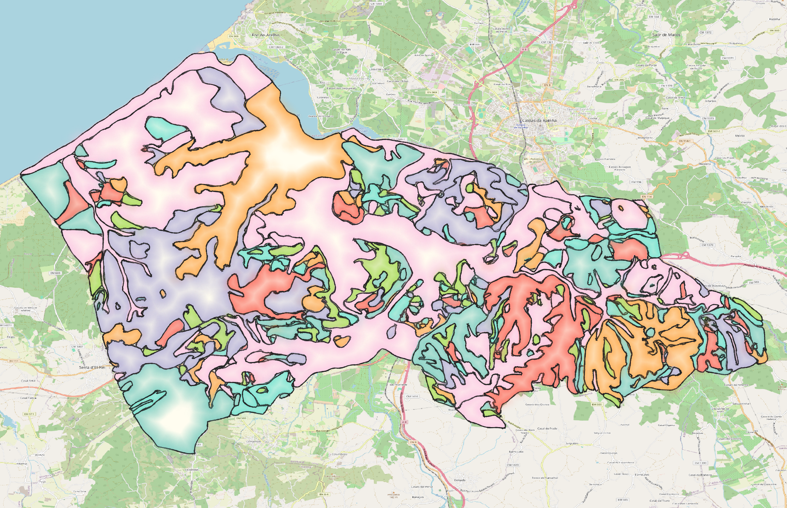

# Sample Kubernetes deployments

This directory contains a sample Kubernetes deployment of:

* A [pygeoapi](https://pygeoapi.io/) instance, configured to show the [CRUS Obidos dataset](https://snig.dgterritorio.gov.pt/rndg/srv/por/catalog.search#/metadata/517c5023-04cc-47a4-99f7-bb32814dd62f)
  from [DGT](https://www.dgterritorio.gov.pt/?language=en), which is served by:
* A PostgreSQL instance set up with the PostGIS extension, which stores the
  lake data.

The Kubernetes manifests needed to run these samples are generated with
[Kustomize](https://kustomize.io/). They build upon [a common base definition](./base/), and the
following types of Kubernetes clusters are supported:

* A local [minikube](https://minikube.sigs.k8s.io/docs/) cluster (see [./minikube/](./minikube/))

## Required tools

To deploy and run these samples you will need the following tools:
* [Kustomize](https://kustomize.io/),
* The [kubectl](https://kubernetes.io/docs/tasks/tools/#kubectl) command-line tool, and
* [bzip2](https://man.freebsd.org/cgi/man.cgi?query=bunzip&apropos=0).

If you have [Nix](https://nix.dev/) installed on your computer, the [Nix flake
definition](./flake.nix) in this directory will install those tools for you.


## How to deply these samples

Check the target-specific instructions, depending on where you are deploying
to:

* [./minikube/README.md](./minikube/README.md)


## Loading the CRUS Obidos dataset

Once the PostgreSQL instance is up and running, use the
[load-data](./load-data) script to feed the crus data into Kubernetes
PostgreSQL instance:

```bash
    $ ./load-data 
+++ dirname ./load-data
++ cd .
++ pwd
+ here=/home/joana/git/hello-k8
+ bzcat /home/joana/git/hello-k8/crus_obidos.sql.bz2
+ kubectl -n pygeoapi-demo exec -i postgresql-0 -- psql --host localhost --user pygeoapi crus
SET
SET
SET
SET
SET
 set_config 
------------
 
(1 row)

SET
SET
SET
SET
SET
SET
DROP INDEX
ALTER TABLE
ALTER TABLE
DROP SEQUENCE
DROP TABLE
CREATE TABLE
CREATE SEQUENCE
ALTER SEQUENCE
ALTER TABLE
COPY 381
 setval 
-s-------
    381
(1 row)

ALTER TABLE
CREATE INDEX
```



## SSL

Create secret in the pygeoapi-demo namespace:

```bash
kubectl create secret tls pygeoapi-tls-secret \
  --cert=/etc/certs/tests_fullchain1.pem \
  --key=/etc/certs/tests_privkey1.pem \
  -n pygeoapi-demo
```
Reload ingress:

```
kubectl apply -f ingress-ssl.yaml
```

## License

This project is released under a [MIT License](./LICENSE)

[](https://opensource.org/licenses/MIT)